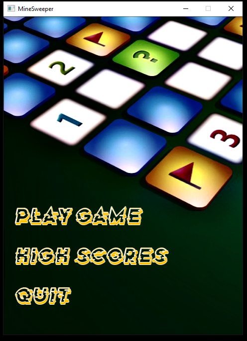
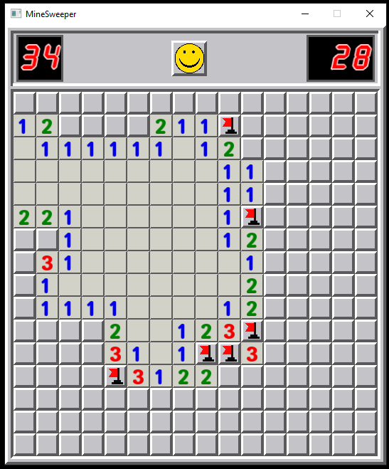

# Minesweeper

This game was built in C++ and SFML.

# Setup
To run this game, do follow these simple steps:
1. Make a empty C++ Project in Visual Studio.
2. Download SFML from browser and Link it to your Empty Project.
3. You can check any tutorial on how to setup SFML on your project.
4. Copy these files onto your project and RUN it.

# Features
You can select one of these 3 levels, Beginner, Intermediate and Advanced.
High Scores are also stored in txt file.
Click Smiley emoji to Restart Game.
